# Multi-Agent Dev Studio Template

> 5 Claude Code agent + GitHub-native orchestration + Telegram notifications.
> "Use this template" deyip yeni proje açtığında, ekip kendi başına çalışmaya başlar.

Bu repo bir **template repository**. Doğrudan kod barındırmaz; yeni bir proje açtığında sana **çalışan bir multi-agent dev studio** verir.

---

## Bu Nedir?

5 farklı rolde Claude Code agent'ı (Product Manager, Architect, Developer, Tester, Orchestrator) bir GitHub repo'sunu sahnesi olarak kullanır. Sen issue açarsın, agent'lar label-driven autonomy ile birbirine top atar, PR'lar üretilir, sen merge edersin.

**Tasarım prensipleri:**

1. **GitHub source of truth.** Hiçbir karar chat'te kalmaz — issue, PR, ADR olarak yaşar.
2. **Human-only merge.** Agent'lar PR açar (draft), sadece sen merge edersin.
3. **Label-driven autonomy.** `agent:*` ve `cc:*` label'ları handoff dilidir.
4. **ADR-driven decisions.** Mimari her karar `docs/decisions/ADR-NNNN-*.md` olarak yazılır.
5. **Telegram, not Discord.** Bildirim `scripts/notify.sh` ile gider (severity level + ORCH→ROLE pattern).

---

## Hızlı Başlangıç

### 1. Yeni proje aç

```bash
gh repo create <username>/<proje-adi> \
  --template <username>/dev-studio-template \
  --public \
  --clone

cd <proje-adi>
```

> **Visibility:** Bu template `--public` default'una göre tasarlanmıştır (ADR-0016).
> Sebep: `PROJECT_TOKEN` canary'si (ADR-0014 §3.5) GitHub Actions kullanır;
> private repolarda Actions aylık kotaya tabidir ve `"job not started"`
> hatası adı altında henüz proje hayata gelmeden init'i düşürür. Private
> istiyorsan `--public` yerine `--private` yaz, ama önce GitHub spending
> limit'i ayarlı olduğundan emin ol. `dev-studio-launcher` v0.3+
> kullanıyorsan zaten default `--public` (ADR-0016).

**Daha kısa yol — launcher kullanarak:**

```bash
new-project.sh <proje-adi>            # default: --public (ADR-0016)
new-project.sh <proje-adi> --private  # opt-in private
```

Launcher repo create + clone + init + label seed'i tek komutta yapar.
Detaylar: https://github.com/atilcan65/dev-studio-launcher

### 2. Init script çalıştır

```bash
bash scripts/dev-studio-init.sh
```

Bu script:
- Placeholder'ları resolve eder (`{{REPO_ROOT}}`, `{{GITHUB_OWNER}}`, `{{GITHUB_REPO}}`, `{{HUMAN_OWNER_NAME}}`)
- 12 `.tmpl` dosyasını render eder (README.md, CLAUDE.md, CODEOWNERS, orchestrator.md, vb.)
- Render sonuçlarını doğrular (kalan placeholder yok → exit 0)

### 3. Label'ları seed et

```bash
bash scripts/bootstrap-labels.sh
```

~35 label oluşturur: `agent:*`, `cc:*`, `status:*`, `type:*`, `priority:*`, `sprint:*`, meta.

### 4. Project board oluştur

```bash
bash scripts/bootstrap-project-board.sh
```

GitHub Projects v2 board kurar:
- 5 kolon: **Backlog → Ready → In Progress → In Review → Done**
- Board'u repo'ya bağlar (repo'nun Projects sekmesinde görünür)
- Mevcut tüm issue'ları board'a ekler (default: Backlog)

> **gh token gereksinimi:** `project` ve `read:project` scope'ları. Eksikse:
> ```bash
> gh auth refresh -s project,read:project
> ```
> Script idempotent: yeniden çalıştırmak güvenli.

> **⚠️ Bir kerelik manuel adım (GitHub API kısıtlaması, ~30 sn):**
> Projects v2 workflow toggle'ları için API yok (community discussion #194509). Board oluştuktan sonra GUI'den:
> 1. Board’u aç (script ekrana URL yazar)
> 2. Sağ üst **⋯ → Workflows**
> 3. **"Auto-add to project"** → Enable, target repository = bu repo
> 4. **"Item closed"** → Enable, Set status: **Done**
> 5. (Opsiyonel) **"Pull request merged"** → Enable, Set status: **Done**
>
> Bu toggle'lar bir kez kurulduktan sonra: yeni issue/PR otomatik Backlog'a düşer, kapandığında Done'a kayar.

### 5. Agent watcher'larını başlat

```bash
bash scripts/dev-studio-start.sh start
```

5 Claude Code instance ayağa kalkar, her biri kendi `agent:<role>` label'lı issue/PR'ları izler.

### 6. (Opsiyonel) systemd watcher'larını kur

```bash
bash scripts/install/dev-studio-install-systemd.sh
```

Reboot sonrası otomatik başlatma için.

---

## 5 Agent Rolü

| Rol | Ne yapar | Ne yapmaz | Dosya |
|---|---|---|---|
| **Orchestrator** | Sprint koordinasyon, board state machine, auto-ping, WIP limit, human eskalasyon | Kod yazmaz, design yapmaz, PR merge etmez | `.claude/agents/orchestrator.md.tmpl` |
| **Product Manager** | Vision/feature → INVEST story, backlog grooming, acceptance criteria (Given/When/Then) | Kod yazmaz, technical design yapmaz | `.claude/agents/product-manager.md` |
| **Architect** | Technical design, ADR, T-shirt sizing, risk değerlendirme | Production kodu yazmaz, sadece interface contract + POC snippet | `.claude/agents/architect.md` |
| **Developer** | Story + design → kod + tests + draft PR | Direct push to main yapmaz, merge yapmaz | `.claude/agents/developer.md` |
| **Tester** | Test plan, adversarial PR review, bug triage, CI gatekeeping | Production kodu yazmaz, sadece test kodu | `.claude/agents/tester.md` |

> **Not:** Bu template'te ayrı "Reviewer" agent yoktur. Code review **Tester**'ın görevidir (adversarial mindset + edge case + code quality).

---

## Sen Ne Zaman Müdahale Edersin?

Üç senaryo:

| Ne zaman | Aksiyonun |
|---|---|
| **Proje başlangıcı** | Vision Intake issue aç (form-based template ile). PM + Architect ilk mimariyi kurar. |
| **Yeni feature** | Feature Request issue aç. PM story'yi yazar, Architect design eder, Developer kod yazar. |
| **PR merge** | Orchestrator `[ORCH→HUMAN] PR #N ready for merge` ping atınca squash-merge yaparsın. |

Bunun dışında **agent'lar arası mesaj kuryesi DEĞİLSİN**. Orchestrator `scripts/notify.sh` ile doğrudan Telegram'a ping atar (agent'lar arası handoff label-driven, Telegram sadece sen ve gözlem için).

---

## Akış 1: Vision Intake (proje başlangıcı, **bir kez**)

```mermaid
flowchart LR
    H[Sen] -->|Issue: agent:product-manager + type:vision| PM[Product Manager]
    PM -->|vision.md + personas.md + initial backlog| O1[Orchestrator]
    O1 -->|cc:architect flip + auto-ping| A[Architect]
    A -->|ADR-0001 System Architecture| O2[Orchestrator]
    O2 -->|cc:product-manager flip + auto-ping| PM2[Product Manager]
    PM2 -->|Vision'ı epic'lere böl, sprint-1 backlog| O3[Orchestrator]
    O3 -->|/sprint-start + auto-ping| H2[Sen: Sprint-1 onayı]
```



**Sprint-1 onayı nasıl verilir?**

Orchestrator `[Sprint 1] Kickoff` adında bir issue açar, içinde sprint planı + commited story listesi olur. Sen:

- **Onaylıyorsan** → issue'ya `+1` reaction veya `lgtm` comment'i + `agent:human` label'ını kaldır → Orchestrator agent atamalarına başlar.
- **Değişiklik istiyorsan** → comment yaz, `cc:product-manager` veya `cc:architect` label'ı flip et → ilgili agent revize eder.

**Vision Intake issue template alanları** (`.github/ISSUE_TEMPLATE/vision-intake.yml`):

- Proje adı
- Problem statement
- Hedef kullanıcı (persona)
- Başarı metrikleri
- MVP kapsamı
- Kapsam dışı
- Teknik tercihler (opsiyonel)
- İlk MVP için target tarih (opsiyonel — Orchestrator sprint planı için kullanır)
- Notlar / detaylar (serbest alan)

Vision issue **bir kez** açılır. Sonradan değişirse yeni ADR olarak yazılır.

---

## Akış 2: Feature Request (proje süresince, **defalarca**)

```mermaid
flowchart LR
    H[Sen] -->|Issue: agent:product-manager + type:feature| PM[Product Manager]
    PM -->|STORY-NNN.md + acceptance criteria| O1[Orchestrator]
    O1 -->|cc:architect flip + auto-ping| A[Architect]
    A -->|Design doc + ADR-needed?| O2[Orchestrator]
    O2 -->|cc:developer flip + auto-ping| D[Developer]
    D -->|Draft PR + tests| O3[Orchestrator]
    O3 -->|cc:tester flip + auto-ping| T[Tester]
    T -->|status:ready label| O4[Orchestrator]
    O4 -->|ORCH→HUMAN ping| H2[Sen: squash merge]
    H2 -->|merged| O5[Orchestrator: status:done]
```



**Architect her zaman pass'ten geçer** — trivial feature'larda "no design needed" diyerek hızlıca geçirir. Bu disiplin: ileride büyük şey çıktığında yakalanır.

**Feature Request issue template alanları** (`.github/ISSUE_TEMPLATE/feature-request.yml`):

- Feature başlığı
- Ne istiyorum (textarea)
- Neden (opsiyonel)
- Öncelik (opsiyonel hint — final karar PM'de)
- İlgili vision parçası (opsiyonel)

---

## Akış 3: Bug ve Incident

Mevcut template'ler:
- `bug.yml` — gündelik bug raporu (`agent:tester` + `type:bug`)
- `incident.yml` — production incident (`agent:orchestrator` + `type:incident` + `priority:P0`)
- `agent-stall.yml` — bir agent dondu (`agent:human` + `priority:P1`)

---

## Akış 4: Sprint Yönetimi (Orchestrator rutini)

Orchestrator'ın iki periyodik komutu var:

### `/sprint-start` — Yeni sprint başlat

Sen veya cron tetikler. Akış:

1. Orchestrator `.claude/CLAUDE.md`'yi okur (product context).
2. PM'i çağırır: top-of-backlog story'leri groom et → `docs/sprints/sprint-NN/backlog.json`.
3. Her `needs-design` story için Architect çağrılır → design doc + (gerekirse) ADR.
4. Story'ler GitHub Project board'unun **Ready** kolonuna eklenir.
5. `docs/sprints/sprint-NN/plan.md` yazılır (hedef, kapasite, commit edilen story'ler, riskler).
6. `[Sprint NN] Kickoff` tracking issue'su açılır, sen mention edilirsin.
7. Sen onaylayınca her story'ye agent atanır, çalışma başlar.

**Sen ne zaman tetiklersin?** Önceki sprint bitti, board boşaldı. Veya 2 haftalık iterasyon takvimine göre cron tetikler.

### `/standup` — Günlük durum

Genelde cron tetikler (ör. hafta içi her sabah 9'da). Akış:

1. Orchestrator her agent'ın heartbeat dosyasını okur — kim canlı, kim takıldı?
2. Son 24 saatteki PR/commit aktivitesini her agent için özetler.
3. Her agent için 3 alan üretir:
   - **Dün:** ne tamamlandı (PR/issue link'leri)
   - **Bugün:** ne üzerinde çalışılıyor
   - **Blocker:** açık engeller + önerilen aksiyon
4. `[Sprint NN] Daily Standup` issue'sunda thread'li comment olarak post'lanır.
5. P0/P1 blocker varsa ayrı `[Blocker]` issue açılır + Telegram ping.

**Sen ne zaman görürsün?** Telegram `[ORCH→ALL] standup posted, day X` ping'i. İstersen issue'ya bakarsın, blocker yoksa müdahale gerekmez.

---

## Telegram Notifications

`scripts/notify.sh` Telegram bot üzerinden tek bir chat'e (senin chat ID'in) ping atar. Severity level'lar:

```bash
notify.sh "[ORCH→PM] STORY-042 ready for grooming"        # default: info ℹ️
notify.sh -l ok    "[ORCH→ALL] PR #15 merged"                # ✅
notify.sh -l warn  "[ORCH→DEV] PR #15 CI flaky, please rerun" # ⚠️
notify.sh -l error "[ORCH→HUMAN] P0 blocker on #N"           # 🚨
```

**Auto-ping pattern** (orchestrator → role/human, mesaj body'sinde):

```
[ORCH→ROLE]  STORY-NNN assigned, see #issue
[ORCH→HUMAN] PR #N ready for merge
[ORCH→ALL]   Sprint N kickoff, day 1
[ORCH→ARCH]  blocker on #N, you decide
```

Tek bir chat'e gider ama braçket pattern'i sayesinde kimin kime ping attığı mesajda net görünür. Agent'lar bu pattern'i `.claude/CLAUDE.md` §Auto-Ping Hard-Rule'dan öğrenir.

**Setup:** Telegram bot token + chat ID `~/.dev-studio-env` dosyasına yazılır. Adım adım kurulum: [`docs/TELEGRAM-SETUP.md`](docs/TELEGRAM-SETUP.md).

---

## Label Sistemi

`bootstrap-labels.sh` 35 label seed eder. Ana kategoriler:

| Prefix | Anlam | Örnekler |
|---|---|---|
| `agent:*` | Story sahibi (kim çalışıyor) | `agent:product-manager`, `agent:architect`, `agent:human` |
| `cc:*` | Handoff hedefi (sıradaki kim) | `cc:developer`, `cc:tester` |
| `status:*` | Workflow durumu | `status:ready`, `status:in-progress`, `status:done` |
| `type:*` | İş tipi | `type:vision`, `type:feature`, `type:bug`, `type:docs` |
| `priority:*` | Aciliyet | `priority:P0` (kritik) ... `priority:P3` (nice-to-have) |
| `sprint:*` | Sprint iterasyonu | `sprint:current`, `sprint:next`, `sprint:backlog` |

**Handoff Discipline:** Bir story bir agent'tan diğerine geçtiğinde owner agent `agent:X` label'ını **kaldırmaz**, sadece `cc:Y` ekler. Orchestrator handoff'u görüp board'u günceller. Detay: `.claude/CLAUDE.md` §Handoff Label Discipline.

---

## Sorun Çıkarsa

| Belirti | Komut | Ne yapar |
|---|---|---|
| Agent yanıt vermiyor | `bash scripts/agent-doctor.sh <role>` | Heartbeat + process + queue durumu |
| Doctrine drift şüphesi | `bash scripts/reprime-agent.sh <role>` | Agent'a `[REPRIME]` mesajı gönderir, role doc'u yeniden okumasını tetikler |
| Watcher process yok | `bash scripts/dev-studio-start.sh start` | tmux session + 5 instance restart |
| Label state karışık | `bash scripts/bootstrap-labels.sh` | Idempotent label refresh (üzerine yazmaz, sadece eksikleri ekler) |
| Template doğrulama | `bash scripts/tests/faz5-smoke.sh` | 5 smoke test (dry-run, broken-tmpl, idempotency, fresh-clone, manual-edit) |
| Agent stuck (event loop) | Issue aç `agent-stall.yml` template ile | Human müdahale tetiklenir |

Tüm operasyonel runbook: `docs/CONTEXT-HYGIENE.md`.

---

## İleri Okuma

- [`.claude/CLAUDE.md.tmpl`](.claude/CLAUDE.md.tmpl) — Project root doctrine (her agent oturum başında okur)
- [`.claude/agents/orchestrator.md.tmpl`](.claude/agents/orchestrator.md.tmpl) — Orchestrator full ruleset
- [`docs/CONTEXT-HYGIENE.md`](docs/CONTEXT-HYGIENE.md) — Doctrine drift önleme, REPRIME protokolü
- [`docs/TELEGRAM-SETUP.md`](docs/TELEGRAM-SETUP.md) — Telegram bot kurulumu (token, chat ID, `.env`)
- [`docs/decisions/INDEX.md.tmpl`](docs/decisions/INDEX.md.tmpl) — ADR index (yeni proje boş başlar)
- [`scripts/README.md`](scripts/README.md) — Tüm script'lerin amacı ve kullanımı

---

## Template Maintenance

Bu template'i geliştirenler için:

- `*.tmpl` dosyaları placeholder'lı kaynak — gerçek render init script'i çalıştığında üretilir
- Yeni placeholder eklemek için `scripts/dev-studio-init.sh` `resolve_placeholders()` fonksiyonunu güncelle
- Smoke test her PR'da çalışır (`.github/workflows/ci.yml`)
- Template flag aktif olmazsa "Use this template" butonu görünmez: `gh api -X PATCH repos/<owner>/dev-studio-template -f is_template=true`

---

**Felsefe:** Bu template, "her projeye yeniden multi-agent kurma" döngüsünü kırmak için yazıldı. Bir proje açıyorsun, 3 komut çalıştırıyorsun, 5 agent'lı bir scrum takımı senin için çalışmaya başlıyor.

Sorun olduğunda PR aç. İyi gittiğinde, bir sonraki projende yine kullan.
