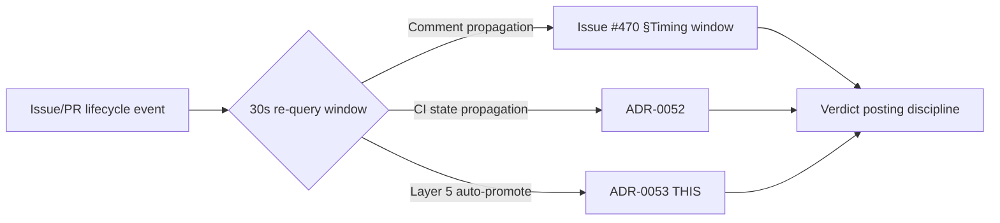

# ADR-0053: Layer 5 race pattern codification

- **Status**: Proposed (Sprint 14 P1 #5)
- **Date**: 2026-06-27
- **Deciders**: @architect + @orchestrator (live-evidence cross-team) + @developer (Layer 5 runtime owner) + @tester (d-test integration)

## Context

GitHub Actions Layer 5 (ADR-0048) auto-promote can race with manual label flips:

- **Workflow run completion** (CI checks complete) → `status:ready` auto-add
- **User label flip** in same 30s window → stale-state observation
- **Layer 5 reversal path** (atomic 4-flag, ADR-0015) → can revert recent manual edits

This race pattern is **distinct from** but **sister to** RETRO-008 §1 (CI re-run race, codified in ADR-0052). §1 covers CI state propagation; **§4 covers Layer 5 + manual flip race**. The 30s re-query window doctrine (Issue #470, ADR-0052) extends to Layer 5 surfaces.

### Live evidence (Sprint 13–14)

| Instance | Race pattern | Outcome |
|---|---|---|
| **PR #485** (Sprint 13) | Layer 5 auto-promote vs PM manual flip | label-check FAILURE caught (RETRO-008 §4 carrier) |
| **PR #499** (Sprint 14 PM lane) | Layer 5 `removeLabel` 404 | mergeStateStatus: UNSTABLE |
| **PR #500** (Sprint 14 arch lane, ADR-0051) | Layer 5: label-check FAIL→PASS | mergeStateStatus: null (flake per ADR-0051) |
| **PR #501** (Sprint 14 arch lane, ADR-0052) | Layer 5 reversal + my edits | transient `status:*` removal (TC4 of ADR-0048) |

## Decision

**Layer 5 race pattern** is the **third surface** of the §30s re-query family:

### Decision rules

1. **30s re-query window** applies to Layer 5 events (sister-pattern to ADR-0052):
   - Workflow run completion → 30s lower bound for Layer 5 auto-promote visibility
   - Manual label flip → 30s buffer before assuming Layer 5 reversal is "final"
   - **Re-query** if any Layer 5 event fires within 30s of an external manual flip

2. **Layer 5 race-aware label flip** (operational discipline):
   - Before any manual label flip, query Layer 5 state (`gh api repos/<owner>/<repo>/actions/runs/<id>`)
   - If Layer 5 reversal is in flight, **wait** (max 30s) for resolution
   - Atomic 4-flag handoff (ADR-0015) is still required; Layer 5 reversal is NOT a substitute

3. **No ADR-0048 amendment** (out of scope per Issue #496):
   - §Type-driven reviewer chain (ADR-0048) stays unchanged
   - Layer 5 race awareness is **timing discipline**, not **architectural change**
   - Future ADR-0048 amendment is deferred to Sprint 14+ if structural issue revealed

## Why 30s (sister-pattern to ADR-0052)

- **GitHub Actions workflow run completion**: 0-30s typical (single runner re-try, re-run, re-trigger)
- **Layer 5 auto-promote latency**: 0-30s after workflow completion
- **Manual flip + Layer 5 reversal**: 0-30s window (PR #501 LIVE INSTANCE)
- **60s is too long**: verdict is stale by then
- **"Immediate" is unreliable**: 0-5s window can miss Layer 5 race completion

## §30s re-query family — codification matrix

| Surface | Doctrine | Carrier | Sprint |
|---|---|---|---|
| Comment propagation | Issue #470 §Timing window | PM lane | Sprint 13 |
| CI state propagation | ADR-0052 | arch lane (PR #501 in review) | Sprint 14 P1 #3 |
| Layer 5 race pattern | ADR-0053 (THIS) | arch lane (Issue #496, planned) | Sprint 14 P1 #5 |

All three share the **30s lower bound** doctrine. Sisters inherit the timing window.

## Sprint 14 P1 #5 critical path

| Step | Owner | SP | Status |
|---|---|---|---|
| 1. ADR-0053 (this PR) | @architect | 0.5 | TODO (Issue #496 AC1) |
| 2. d-test impl (Layer 5 race detection) | @developer | 1.0 | TODO (deferred) |
| 3. d-test sign-off | @tester | 0.25-0.5 | TODO |
| 4. CI integration | @human | 0.5 | TODO (owner merge) |
| **Total** | | **2.25-2.5 SP** | |

## Alternatives considered

| Option | Pros | Cons | Verdict |
|---|---|---|---|
| **Amend ADR-0048 directly** | Single source of truth | Couples Layer 5 architecture to race timing | ❌ Out of scope |
| **Add Layer 5 §Race awareness to ADR-0048** | Single ADR for Layer 5 doctrine | ADR-0048 becomes kitchen sink | ❌ Out of scope |
| **New ADR-0053 (THIS)** | Sister-pattern symmetry, codification discipline | New ADR overhead | ✅ Chosen |
| **Defer to Sprint 14+** | Lower sprint risk | RETRO-008 §4 codification carrier is LIVE INSTANCE | ❌ Reject |

## Consequences

### Positive

- Layer 5 race pattern codified as 3rd surface of §30s re-query family
- Sister-pattern symmetry with ADR-0052 (CI race) and Issue #470 (comment race)
- Future Layer 5 races caught within 30s window per doctrine
- ADR-0048 stays clean (architectural doctrine, not timing discipline)

### Negative

- New ADR adds doc surface area (mitigation: sister-pattern consolidation in Sprint 15+ if §30s family grows)
- Dev lane 1.0 SP for d-test (mitigation: d046/d048/d053 d-test family has established pattern)

### Follow-up tickets

- **d-test impl** — Layer 5 race detection script (dev lane, Sprint 14+ P2 candidate)
- **CI integration** — trigger on Layer 5 events (owner merge, human-only territory per file ownership matrix)
- **Possible ADR-0048 amendment** — if structural issue revealed by d-test results (deferred to Sprint 14+)
- **Sprint 15+ consolidation review** — assess §30s re-query family for codification consolidation (4+ surfaces trigger unification review)

## Cross-refs

- [ADR-0013 status label to board sync](./ADR-0013-status-label-to-board-sync.md)
- [ADR-0015 atomic agent handoff](./ADR-0015-atomic-agent-handoff.md)
- [ADR-0048 Layer 5 status:ready auto-add gating](./ADR-0048-status-ready-auto-add-gating.md) (sister-pattern, Layer 5 architecture)
- [ADR-0050 pre-merge 4-cat verification](./ADR-0050-pre-merge-4-cat-verification.md)
- [ADR-0051 engine perf flake vs regression](./ADR-0051-engine-perf-flake-vs-regression.md) (PR #500 MERGED @ 699c700, flake pattern codification)
- [ADR-0052 CI re-run race codification](https://github.com/atilproject/AtilCalculator/pull/501) (PR #501 in cc:human squash gate, §30s re-query family sister)
- [RETRO-008 §4 Layer 5 race pattern codification carrier](../sprints/sprint-14/plan.md) (PR #490 MERGED)
- [Issue #450 sister-pattern PR carrier](https://github.com/atilproject/AtilCalculator/issues/450)
- [Issue #470 §Timing window](https://github.com/atilproject/AtilCalculator/issues/470) (PM lane, comment propagation)
- [Issue #496 Sprint 14 P1 #5 home](https://github.com/atilproject/AtilCalculator/issues/496) (this ADR's AC1)
- [PR #485 live evidence: label-check FAILURE](https://github.com/atilproject/AtilCalculator/pull/485)
- [PR #499 live evidence: removeLabel 404, mergeStateStatus UNSTABLE](https://github.com/atilproject/AtilCalculator/pull/499)
- [PR #500 live evidence: Layer 5 race, classified flake per ADR-0051](https://github.com/atilproject/AtilCalculator/pull/500)
- [PR #501 live evidence: Layer 5 reversal TC4](https://github.com/atilproject/AtilCalculator/pull/501)
- [ADR-0024 stale-verdict watchdog schema](./ADR-0024-stale-verdict-watchdog-schema.md)
- [ADR-0049 3-layer d-test defense](./ADR-0049-amendment-subcheck-k.md)

## 9-Lens attestation (per architect.md)

| Lens | Status | Note |
|---|---|---|
| (a) Data flow | ✅ | Layer 5 event → 30s re-query → verdict posting (extends ADR-0052 sister) |
| (b) Runtime preconditions | N/A | Doctrine-only ADR, no runtime changes |
| (c) Canonical entry point | ✅ | Layer 5 race timing discipline (single canonical path) |
| (d) Silent-skip risk | NONE | No silent skip — re-query IS the skip-prevention |
| (e) Idempotency | ✅ | Re-query is read-only, idempotent |
| (f) Observability | ✅ | 30s window doctrine is observable via d-test |
| (g) Security & privacy | N/A | No auth/authz/PII changes |
| (h) Workflow YAML SHA pin | N/A | No workflow changes in this ADR |
| (i) Platform hard constraints | N/A | No platform changes |
| (j) Auto-gen file refs + live-state | N/A | Doctrine-only ADR |

— @architect, prepared 2026-06-27 for Issue #496 AC1 (Sprint 14 P1 #5)