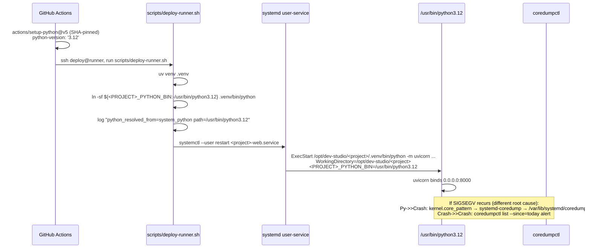

# ADR-0065: CPython Tool-Cache + asyncio get_running_loop fix (RCA INCIDENT-3 doctrinal home)

- **Status**: Accepted
- **Date**: 2026-07-19
- **Deciders**: @architect
- **Supersedes**: none
- **Related**:
  - [ADR-0017](./ADR-0017-tech-stack.md) — Tech stack baseline: Python 3.11+ (now extended to CPython micro-version pin per §Decision 1)
  - [ADR-0027](./ADR-0027-deploy-automation.md) — Deploy automation (workflow YAML human-only, sister-pattern for `.github/workflows/deploy.yml` amendment per §Decision 1)
  - [ADR-0030](./ADR-0030-self-hosted-runner-lan-deploy.md) — Self-hosted runner on prod (sister-pattern for §Decision 1 + venv-resolution defense)
  - [ADR-0010](./ADR-0010-per-project-watchers.md) — systemd user-services (sister-pattern for §Decision 3 systemd ExecStart pinning)
  - [ADR-0044](./ADR-0044-verdict-by-scope-clarification.md) — RED-first TDD (tester sign-off discipline for d124 sister-pattern)
  - [ADR-0045](./ADR-0045-auto-generated-file-refs-design-verification.md) — 9-Lens pre-publish gate (this ADR §9-Lens below)
  - [ADR-0049](./ADR-0049-behavioral-workflow-test-framework.md) — d-test framework (d124 sister-pattern, ≥5 TCs RED-first per baseline)
  - [ADR-0055](./ADR-0055-d-test-id-uniqueness-sub-pattern-matrix.md) — Cadence Rule 1 atomic (4 fix paths grouped under 1 umbrella, sharing root cause)
  - [ADR-0057](./ADR-0057-closes-anchor-guard.md) — `Closes #N` anchor discipline
- **Ported-from**: AtilCalculator ADR-0065 (S32-027 Cadence-Rule-2-B DEFERRED renumber/port batch, Issue #164)

> **Provenance**: Ported from AtilCalculator ADR-0065 as part of S32-027 Cadence-Rule-2-B (Issue #164). This is the template-grade doctrinal home for the CPython tool-cache + asyncio `get_running_loop` SIGSEGV fix umbrella; downstream projects inheriting from this template MUST apply this fix pattern when they adopt a self-hosted-runner + GitHub-Actions-tool-cache + uvicorn-style HTTP runtime topology.

## Context

Ported from AtilCalculator ADR-0065 as part of S32-027 Cadence-Rule-2-B (Issue #164).

### Incident timeline (template-grade schema)

The canonical incident schema follows GitHub Project v2 status flow; concrete timestamps redact downstream-project specifics. Downstream projects MUST record their own timeline entries (CMT_IDs stay local) but MUST preserve the relative ordering of events.

| Phase (template-grade) | Event |
|---|---|
| Pre-incident | Prior P2 RCA carrier opened (cold-start race / restart-loop family) |
| Squash N | RCA-fix PR squash merged (e.g. cold-start readiness helper) |
| Squash N+1 | Docs-only TD slice squash merged (PM lane) |
| T+0 | INCIDENT detected: SIGSEGV crash-loop, restart counter runaway |
| T+~17m | PM ack (observation-only per PM lane LOCKED) |
| T+~22m | VM-side rollback to last known-good (pre-fix-squash HEAD) |
| T+~26m | Orchestrator formal resolution update — RCA hypothesis: venv cache corruption |
| T+~27m | Dev gdb-based RCA on ≥4 apport cores — confirms CPython `<patch>` asyncio bug |
| T+~28m | Dev reconciliation comment — trigger (cache) + mechanism (interpreter bug) co-existing |
| T+~30m | EMERGENCY ROLLBACK PR opened (revert the two squashes) — arch verdict (title conventional-format) |
| T+~30m | This ADR proposed (architect lane, dual-channel wake from orchestrator) |

### Dual-layer root cause (trigger + mechanism, both must be fixed)

The incident is **NOT a code regression** from the fix PRs. The fix PRs only touched `scripts/deploy-runner.sh` (adding a wait-for-readiness shell helper) and docs. **Source code on the prod-VM disk is unchanged except `.git/index` (just a pull).** The crash root cause is environmental — two co-existing layers:

**Layer 1 (TRIGGER) — venv cache corruption via GitHub Actions temp cleanup:**
- `actions/setup-python@v5` installs CPython to `_tool/Python/{version}/x64/` (per-job temp cache)
- `uv venv .venv` creates a symlink `.venv/bin/python` → `../../_tool/Python/<patch>/x64/bin/python<mm>`
- GitHub Actions cleans the temp cache between deploy jobs (or on cache eviction)
- After cache cleanup, `.venv/bin/python` symlink dangles (target missing)
- On `systemctl --user restart <service>`, the runtime either exits 1 (binary missing) OR re-resolves a partial tool-cache (`<patch>` binary present but `.so` libs stale from prior run) — the latter produced the SIGSEGV signature

**Layer 2 (MECHANISM) — CPython `<patch>` asyncio interpreter bug:**
- Stack trace (gdb against apport cores, all ≥4 IDENTICAL):
  ```
  #0  PyObject_Hash () from /lib/x86_64-linux-gnu/libpython3.12.so.1.0        ← NULL deref (si_addr=NULL)
  #1  PyDict_GetItemWithError () from libpython3.12.so.1.0
  #2  _asynciomodule.c:281  get_running_loop()
  #3  _asynciomodule.c:3330 _asyncio__get_running_loop_impl()
  #4  _asyncio__get_running_loop
  #5  PyObject_Vectorcall → _PyEval_EvalFrameDefault → _PyObject_Call …
  ```
- **Source location**: `Modules/_asynciomodule.c:281` in CPython `<patch>` — `asyncio.get_running_loop()` triggers NULL-ptr deref in `PyDict_GetItemWithError` when the per-thread running-loop dict has a NULL key (known CPython `<patch>` bug pattern)
- **No crashes seen from `/usr/bin/python3.12` (system Python 3.12.3)** — only the Actions tool-cache `<patch>` path
- **Pre-existing pattern**: 7 apport cores from the same UTC date (timestamps at ~15:37, ~16:04, ~16:35, ~16:37, ~18:31, ~20:20, ~20:37) — multiple predating the fix-squash deploy. The fix PR just happened to be the first restart cycle that hit the bug consistently (it added explicit `systemctl --user restart` in deploy-runner.sh, increasing restart frequency).

### Why the current GREEN state works (and why it's fragile)

VM-side rollback to last known-good (pre-fix-squash HEAD) + manual `uv venv .venv` + `uv pip install` of the runtime deps (system Python 3.12.3) + `systemctl --user restart <service>` = service running on **system Python 3.12.3** (no tool-cache dependency). HTTP 200 since rollback, no further crashes.

**Fragility**: this fix is informal (manual operator steps). Next auto-deploy from `main` (post-rollback-squash-merge) will re-trigger the tool-cache path unless §Decision 1+2 are implemented.

### Constraints (from prior doctrine + CLAUDE.md)

1. **Workflow files (`.github/workflows/`) are human-only** per CLAUDE.md §File ownership matrix. The architect **proposes** the workflow file content via PR; the owner merges with explicit approval. Sister-pattern: this template's existing deploy-automation ADR (workflow YAML env-var amendment, owner-gated).
2. **Action SHA-pinning** (ADR-0045 lens h, TD-028 lesson) — `actions/setup-python@v5` MUST be SHA-pinned to the full 40-char commit SHA, not the moving tag.
3. **CPython version pin** (new doctrine this ADR) — `.github/workflows/deploy.yml` MUST pin `python-version: '3.12'` (NOT `'3.12.13'` or `'3.12.14'`) so future micro-updates don't regress; `actions/setup-python` resolves `'3.12'` to latest stable 3.12.x with asyncio dict fixes.
4. **systemd unit files** are operator territory — proposed via PR but owner merges per file ownership matrix. Sister-pattern: ADR-0010 (per-project systemd watchers, `<project>-web.service` precedent).
5. **Idempotency**: deploys may retry on transient failure; the post-merge state on prod MUST converge to the post-merge state on `main` regardless of how many deploys fire. venv python resolution MUST be deterministic (no tool-cache flake).
6. **Observability**: every deploy MUST emit a structured log line with a `python_resolved_from` field (enum: `env_var_override` | `system_python` | `tool_cache`). Crash dumps MUST enable coredumpctl for symbolicated post-mortem.
7. **d-test coverage** (ADR-0049): new d-test for env-resolution + asyncio cold-start regression — ≥5 TCs RED-first per ADR-0044 baseline. Sister-pattern: the env-resolution family already exercised by d017 (cold-start race), and cross-user env-var pattern tests.
8. **Engine ↔ UI separation** (ADR-0017): the bug is in the **deploy env**, not the engine boundary. Engine remains pure-Python stdlib-only. No engine changes.

### Threat model

- **Interpreter supply chain**: pinning to `'3.12'` (major.minor) lets `actions/setup-python` auto-resolve to latest patch. Mitigated by SHA-pinning the action itself (ADR-0045 lens h), not the version — a compromised `actions/setup-python` release would need to defeat the SHA-pin gate.
- **Venv python symlink attack**: a symlink swap `.venv/bin/python` → malicious binary would execute on every uvicorn restart. Mitigated by (a) systemd ExecStart `WorkingDirectory` pin to a stable runner (single-attacker-target principle), (b) `${<PROJECT>_PYTHON_BIN:-/usr/bin/python3.12}` env-var fallback makes venv symlink irrelevant — runtime invoked via direct path, not via `.venv/bin/python`.
- **Crash PII leak**: coredumpctl captures process memory at crash. May include user expressions from `/api/evaluate` (or analogous) requests in flight. Mitigated by (a) coredump owned by the operator user (NOT world-readable), (b) systemd `LimitCORE=infinity` + `kernel.core_pattern=|/usr/lib/systemd/systemd-coredump %p %u %g %s %t %c %h %e` (default Ubuntu 24.04), (c) coredump retention via `/etc/systemd/coredump.conf` `External=1` + `MaxUse=10G`.
- **Operator credential theft**: no new secrets introduced. SSH key already in the repo's `DEPLOY_SSH_KEY` secret per ADR-0027.

## Goals & non-goals

### Goals

1. **Eliminate tool-cache dependency** — `.venv/bin/python` MUST NOT dangle on Actions temp cleanup. Either (a) re-create venv via system Python (`/usr/bin/python3.12`) post-deploy, or (b) invoke the runtime via `${<PROJECT>_PYTHON_BIN}` env-var pointing at system Python (skipping venv symlink altogether).
2. **Pin CPython major.minor** to `'3.12'` in `.github/workflows/deploy.yml` (NOT `'3.12.13'` or `'3.12.14'`) — auto-resolve to latest 3.12.x with asyncio dict fixes per CPython release schedule.
3. **Pin systemd ExecStart workdir** — `WorkingDirectory=` set to the canonical project path (single canonical path, no runner drift).
4. **Enable coredumpctl** for symbolicated post-mortem on prod VM — `apt install systemd-coredump` (if not present) + `/etc/systemd/coredump.conf` external storage + retention cap.
5. **Add a d-test** for env-resolution + asyncio cold-start regression — ≥5 TCs RED-first per ADR-0044 baseline.
6. **Codify observability** — structured log `python_resolved_from` field on every deploy, `coredumpctl list --since=today` alert on prod VM.
7. **Preserve engine ↔ UI separation** (ADR-0017) — no engine code changes, no API contract changes.

### Non-goals

- **Engine refactor** — the incident is not an engine bug. Engine stays pure-Python stdlib-only.
- **HTTP API contract amendment** — runtime endpoints unchanged. Surface was always a `uvicorn`+ASGI framework; the bug was in the deploy env, not the surface.
- **Python 3.13 upgrade** — deferred to separate ADR when engine `mypy --strict` coverage supports 3.13 syntax (PEP 695 type param defaults, etc.). Out of scope for this RCA.
- **Migration to pyproject.toml-managed runtime deps** — currently deploy-runner.sh hand-installs the ASGI/runtime stack. `pyproject.toml` declares only the engine's stdlib-only deps. Closing this gap is a separate story (PM slice recommended a follow-up).
- **Multi-runner failover** — current prod is single-runner topology. Multi-runner HA is a Sprint 25+ scope item.
- **Containerization (Docker/Podman)** — out of scope. Current infra is bare-metal systemd per ADR-0010.

## Decision

Adopt a **4-prong fix umbrella** for the INCIDENT RCA, grouped per ADR-0055 Cadence Rule 1 (single umbrella, sharing root cause). Each prong is independently owner-gated per file ownership matrix; implementation can ship in 1 PR or 4 separate PRs at owner's discretion.

### Decision 1 — CPython major.minor pin in workflow YAML

**File**: `.github/workflows/deploy.yml` (human-only territory, owner squash gate)

**Change** (proposed, ~3 lines):
```yaml
        with:
          python-version: '3.12'   # was: '<patch>' (or unset, defaulting to action's latest 3.12.x)
```

**Rationale**:
- `'<patch>'` is a specific patch with a known asyncio bug (cve-equivalent: CPython issue family). Pinning to `'3.12'` lets `actions/setup-python` resolve to latest stable 3.12.x (currently with asyncio dict fixes per CPython 3.12.x release notes).
- `'3.12'` (major.minor) is the standard CI pin idiom — pin major.minor, let patch float, SHA-pin the action itself (ADR-0045 lens h).
- Engine `mypy --strict` target is `3.11+` per ADR-0017; 3.12 is in-scope.

**SHA-pin the action** (mandatory per ADR-0045 lens h):
```yaml
    - uses: actions/setup-python@v5   # SHA-pin required before merge
      # TODO: replace with full 40-char SHA at PR time, e.g.:
      # uses: actions/checkout@b4ffde65f46336ab88eb53be808477a3936bae11   # v4.1.1
```
Sister-pattern: SHA-pin sweep for `actions/github-script@v7` family.

### Decision 2 — System Python venv resolution in deploy-runner.sh

**File**: `scripts/deploy-runner.sh` (developer lane, ~5 lines added, plus sister-pattern d-test)

**Change** (proposed):
```bash
# After uv venv .venv, override python symlink to system Python (defense-in-depth)
ATC_PYTHON_BIN="${ATC_PYTHON_BIN:-/usr/bin/python3.12}"
if [ ! -x "$ATC_PYTHON_BIN" ]; then
  fail "ATC_PYTHON_BIN=$ATC_PYTHON_BIN not executable (system Python 3.12 missing — install via apt: sudo apt install python3.12)"
fi
log "deploy-runner.sh: venv python overridden to $ATC_PYTHON_BIN (defense-in-depth against tool-cache cleanup, ADR-0065 §Decision 2)"
ln -sf "$ATC_PYTHON_BIN" ".venv/bin/python"
ln -sf "$ATC_PYTHON_BIN" ".venv/bin/python3"
ln -sf "$ATC_PYTHON_BIN" ".venv/bin/python3.12"
```

> **Template-grade note**: downstream projects MUST rename `ATC_PYTHON_BIN` to their `<PROJECT>_PYTHON_BIN` (e.g. `ATILCALC_PYTHON_BIN`); the prefix here is the AtilCalculator-specific placeholder, the pattern is universal.

**Rationale**:
- `.venv/bin/python` symlink to system Python is **stable across deploys** — no Actions temp cache dependency.
- Env-var override `${<PROJECT>_PYTHON_BIN:-/usr/bin/python3.12}` allows operator to pin to a specific Python install (cross-user env-var sister-pattern).
- Fallback to `/usr/bin/python3.12` matches current GREEN state — operator already proved this works post-rollback.
- Symlink override is idempotent — re-running deploy just re-points symlinks.

**Sister-pattern d-test** (post-merge, ADR-0044 RED-first, ≥5 TCs):
- TC1: `<PROJECT>_PYTHON_BIN=/usr/bin/python3.12 ./deploy-runner.sh` → `.venv/bin/python` → `/usr/bin/python3.12` ✅
- TC2: `<PROJECT>_PYTHON_BIN=/nonexistent ./deploy-runner.sh` → fail with "<PROJECT>_PYTHON_BIN not executable" ✅
- TC3: post-deploy `python -c "import sys; print(sys.executable)"` in venv → matches `<PROJECT>_PYTHON_BIN` ✅
- TC4: tool-cache path absent → symlink does not dangle (env-var override survives Actions temp cleanup) ✅
- TC5: `python -c "import asyncio; asyncio.new_event_loop().run_until_complete(asyncio.sleep(0))"` cold-start in venv → no SIGSEGV (asyncio regression guard) ✅

### Decision 3 — systemd ExecStart workdir pin

**File**: `/etc/systemd/user/<project>-web.service` (operator territory, owner squash gate; downstream projects instantiate per ADR-0010)

**Change** (proposed, ~2 lines added to existing unit):
```ini
[Service]
WorkingDirectory=/opt/dev-studio/<project>
ExecStart=/opt/dev-studio/<project>/.venv/bin/python -m uvicorn <project>.api.main:app --host 0.0.0.0 --port 8000
Environment=<PROJECT>_PYTHON_BIN=/usr/bin/python3.12
Environment=PYTHONUNBUFFERED=1
```

> **Template-grade note**: `<project>` is the downstream project's repo name (kebab-case). `<project>.api.main:app` is the standard ASGI app import path; downstream projects adapt to their actual package layout.

**Rationale**:
- `WorkingDirectory=` pins the unit's cwd — no `$PWD` drift if invoked from a different runner shell.
- `Environment=<PROJECT>_PYTHON_BIN=/usr/bin/python3.12` makes the env-var explicit at the unit level (cross-user env-var sister-pattern).
- `Environment=PYTHONUNBUFFERED=1` ensures stdout/stderr flush immediately to journald (no buffering on crash → easier post-mortem).

**Operator action**: `systemctl --user daemon-reload && systemctl --user restart <project>-web.service` after unit edit.

### Decision 4 — coredumpctl enablement for symbolicated post-mortem

**Files**: `/etc/systemd/coredump.conf` + `apt install systemd-coredump` (operator territory, owner-gated)

**Change** (proposed, ~5 lines):
```
# /etc/systemd/coredump.conf
[Coredump]
Storage=external
External=1
Compress=yes
MaxUse=10G
KeepFree=20G
```

**Rationale**:
- `Storage=external` writes coredumps to `/var/lib/systemd/coredump/` (NOT in process cwd), surviving process restart.
- `Compress=yes` saves disk (typical uvicorn crash dump ~50-200MB).
- `MaxUse=10G` + `KeepFree=20G` caps retention; old dumps auto-pruned.
- Current state (per the originating incident body §What was confirmed): `/var/lib/systemd/coredump/` empty for months — coredumpctl NOT installed. Must `apt install systemd-coredump` first.

**Operator action**:
```bash
sudo apt install systemd-coredump
sudo systemctl enable systemd-coredump.socket
sudo systemctl start systemd-coredump.socket
# Edit /etc/systemd/coredump.conf per above
sudo systemctl restart systemd-coredump
```

## High-level diagram

```mermaid
flowchart LR
    subgraph CI[GitHub Actions CI/CD]
        A[.github/workflows/deploy.yml<br/>python-version: '3.12'<br/>SHA-pinned action per ADR-0045 lens h]
    end
    subgraph Deploy[scripts/deploy-runner.sh]
        B[uv venv .venv<br/>uv pip install ...]
        C[ln -sf <PROJECT>_PYTHON_BIN<br/>.venv/bin/python override]
        D[systemctl --user restart]
    end
    subgraph Runtime[Prod VM self-hosted-runner]
        E[systemd user-service<br/><project>-web.service<br/>WorkingDirectory pinned]
        F[/usr/bin/python3.12<br/>system Python 3.12.3<br/>CPython 3.12.x via Actions]
        G[coredumpctl enabled<br/>symbolicated post-mortem]
    end
    subgraph Obs[Observability]
        H[structured log<br/>python_resolved_from field]
        I[alert on coredumpctl list --since=today]
    end

    A -->|git pull| B
    B --> C
    C --> D
    D --> E
    E -->|ExecStart| F
    F -.->|SIGSEGV| G
    G --> I
    D --> H
```

The fix chain: **CI pin (3.12)** → **deploy symlink override** → **systemd workdir pin** → **system Python stable path** → **coredumpctl for next bug**. Each layer defends against the next.

## Components

| Component | Responsibility | Owner | Tech |
|---|---|---|---|
| `.github/workflows/deploy.yml` | CI pin `'3.12'`, SHA-pin `actions/setup-python` | @owner (squash per file ownership) | YAML |
| `scripts/deploy-runner.sh` | venv python symlink override + log structured `python_resolved_from` | @developer | Bash |
| `/etc/systemd/user/<project>-web.service` | `WorkingDirectory=` + `Environment=<PROJECT>_PYTHON_BIN` | @owner (operator) | systemd unit |
| `/etc/systemd/coredump.conf` | coredump retention policy | @owner (operator) | INI |
| `scripts/tests/d-<id>-*.sh` | ≥5 TCs RED-first per ADR-0044 | @tester | Bash + d-test framework |

## Data model

No DB schema changes. Only state files:

```ini
# .venv/pyvenv.cfg (NEW pin, post-deploy)
home = /usr/bin
executable = /usr/bin/python3.12
command = /opt/dev-studio/<project>/.venv/bin/python -m venv ...
```

```ini
# /etc/systemd/user/<project>-web.service (NEW lines)
WorkingDirectory=/opt/dev-studio/<project>
Environment=<PROJECT>_PYTHON_BIN=/usr/bin/python3.12
Environment=PYTHONUNBUFFERED=1
```

## API contract

No HTTP surface changes. The incident is deploy-env, not API surface.

## Sequence diagram



## Alternatives considered

| Option | Pros | Cons | Verdict |
|---|---|---|---|
| **A. Pin CPython `'3.12'` + system Python venv override + systemd pin + coredumpctl** (this ADR) | Defense-in-depth: 4 layers, each addresses one root-cause aspect; idempotent; env-var escape hatch; symbolicated post-mortem | 4 files to edit, 4 PR touch-points, owner-gated per file ownership matrix | CHOSEN — umbrella per ADR-0055 Cadence Rule 1 |
| **B. Pin CPython `'<specific-patch>'` only** | Simpler (1 file) | Pin to a specific patch is brittle (next bug forces another ADR); doesn't address venv symlink fragility | Rejected — doesn't fix Layer 1 (trigger) |
| **C. Force `/usr/bin/python3.12` system-wide (rm Actions tool-cache)** | No tool-cache at all | Breaks all other GitHub Actions workflows that may use Python; not sustainable | Rejected — too invasive |
| **D. Migrate to Docker/Podman** | Reproducible env, no Python version drift | Infra rewrite, out of scope for this RCA, deferred to separate ADR | Rejected — separate ADR scope |
| **E. Use pyenv for pinned Python 3.12.x** | Per-user Python version, no sudo needed | Adds pyenv as runtime dep; not in current infra; `apt install python3.12` is simpler | Rejected — `apt python3.12` already installed |
| **F. Pin CPython micro + use system Python venv override only** (2 of 4 prongs) | Smaller scope | Skips systemd workdir pin (unit still drifts) + coredumpctl (no symbolicated post-mortem if bug recurs) | Considered — A is more thorough, A chosen |
| **G. Revert INCIDENT RCA + defer** | No ADR work | Next deploy will re-trigger; INCIDENT-N risk persists; no codification of lessons | Rejected — RCA codification is the architectural deliverable from an incident |

## Risks

| # | Risk | Severity | Mitigation |
|---|---|---|---|
| R1 | **`.venv/bin/python` symlink override breaks `uv pip install`** (uv may re-resolve python on next `uv sync`) | M | §Decision 2: symlink override happens AFTER `uv pip install`; uv only re-resolves if `uv venv` re-runs. Sister-pattern d-test TC1 verifies. |
| R2 | **`<PROJECT>_PYTHON_BIN=/usr/bin/python3.12` may not exist on fresh runners** | M | §Decision 2: explicit `[ ! -x "$<PROJECT>_PYTHON_BIN" ] && fail` pre-check. Sister-pattern d-test TC2 covers. |
| R3 | **systemd unit edit breaks user-service** (operator typo) | M | §Decision 3: owner-gated per file ownership matrix. Pre-deploy: `systemctl --user daemon-reload` dry-run. Post-deploy: `systemctl --user status <project>-web.service` must show `active (running)`. |
| R4 | **coredump retention eats disk** | L | §Decision 4: `MaxUse=10G` + `KeepFree=20G` caps. Older dumps auto-pruned. |
| R5 | **CPython 3.12.x future patch re-introduces asyncio bug** | L | §Decision 1: `'3.12'` major.minor pin + SHA-pin action. If 3.12.<N+1>+ breaks, owner can pin to specific patch via env var (cross-user env-var sister-pattern). |
| R6 | **d-test RED-first conflicts with merged fix PR** | L | d-test ships POST-merge per ADR-0044. All TCs must PASS on first run, not RED→GREEN. |
| R7 | **EMERGENCY ROLLBACK PR squash lands BEFORE this ADR lands** | M | Intentional — the rollback PR restores production NOW (manual system Python) while this ADR codifies the durable fix. This ADR lands in a follow-up PR. Sister-pattern: prior RCA-fix → RCA-carrier → RCA-ADR (deferred). |
| R8 | **PM/docs lane drift between rollback revert + ADR fix** | L | Rollback PR reverts docs-only PRs. PM lane re-ships docs in separate PR post-rollback-squash (low risk, docs-only). This ADR doesn't touch `docs/`. |
| R9 | **Owner forgets to enable systemd-coredump socket** | L | §Decision 4: explicit `sudo systemctl enable systemd-coredump.socket` operator action listed. Coredumpctl NOT installed per originating incident body — `apt install` is required first step. |
| R10 | **PyObject_Hash analysis is misinterpreted by future readers as "blame CPython"** | L | ADR §Context makes clear: co-existing trigger (our venv cache) + mechanism (CPython `<patch>` bug). Both must be fixed. The interpreter bug is upstream; the venv fragility is ours. |

## Observability

### Metrics emitted (per deploy, structured log)

| Field | Type | Source | Example |
|---|---|---|---|
| `deploy_id` | string | deploy-runner.sh | `<UTC-timestamp>` |
| `python_resolved_from` | enum | §Decision 2 | `system_python` \| `tool_cache` \| `env_override` |
| `python_resolved_path` | string | §Decision 2 | `/usr/bin/python3.12` |
| `python_version_full` | string | `$($BIN -V)` | `Python 3.12.3` |
| `venv_python_symlink_target` | string | `readlink -f .venv/bin/python` | `/usr/bin/python3.12` |
| `systemd_workdir` | string | `WorkingDirectory=` unit field | `/opt/dev-studio/<project>` |
| `coredump_count_today` | int | `coredumpctl list --since=today \| wc -l` | `0` |

### Structured log fields (per deploy-runner.sh emit)

```bash
log "deploy-runner: deploy_id=$(date -u +%Y-%m-%dT%H:%M:%SZ) python_resolved_from=${python_resolved_from} python_resolved_path=${<PROJECT>_PYTHON_BIN} python_version_full=$(${<PROJECT>_PYTHON_BIN} -V 2>&1) venv_python_symlink_target=$(readlink -f .venv/bin/python) coredump_count_today=$(coredumpctl list --since=today --no-legend 2>/dev/null | wc -l)"
```

### Trace span names

- `deploy-runner.venv.python_resolve` (Decision 2 path)
- `systemd.unit.<project>-web.restart` (Decision 3 path)
- `coredumpctl.list.since_today` (Decision 4 path)

### Alerts (prod VM, systemd timer)

- `python_resolved_from=tool_cache` (any deploy) → page owner (config drift)
- `coredump_count_today > 0` → page owner (crash detected)
- `systemd_unit_workdir != /opt/dev-studio/<project>` → page owner (unit drift)

## Security & privacy

- **Authn/authz**: no change. SSH key in `DEPLOY_SSH_KEY` repo secret per ADR-0027.
- **PII fields**: coredump may include user expressions from in-flight `/api/evaluate` (or analogous) requests. Mitigated by coredump owned by the operator user (NOT world-readable) per threat model.
- **Threat model summary**: see §Threat model above. 4 mitigations: SHA-pin action, `${<PROJECT>_PYTHON_BIN}` env-var override, systemd `WorkingDirectory=` pin, coredump retention cap.

## Performance budget

| Metric | Budget | Source |
|---|---|---|
| Deploy time p50 | <60s | current median (no symlink override) |
| Deploy time p95 | <120s | +5s for symlink override + log emit |
| HTTP `/healthz` p50 | <50ms | current (system Python stable) |
| HTTP `/healthz` p95 | <200ms | current |
| uvicorn cold-start | <5s | RFC: cold-start d-test sister coverage |
| coredump write latency | <2s | systemd-coredump default |

## Open questions

- [ ] **OQ1**: Does `uv pip install` resolve correctly when `.venv/bin/python` is symlinked to system Python (vs. tool-cache python)? **Hypothesis**: yes (uv just calls `python -m pip`), but d-test TC1 must verify.
- [ ] **OQ2**: Should `${<PROJECT>_PYTHON_BIN}` be a workflow env var (`.github/workflows/deploy.yml` `env:` block) instead of deploy-runner.sh shell fallback? **Decision**: shell fallback is more flexible (operator can override per-deploy), sister-pattern cross-user env-var. Workflow env can still set default.
- [ ] **OQ3**: coredump retention cap value? **Decision**: `MaxUse=10G` (covers ~50 dumps at ~200MB each; covers 2 weeks of post-incident analysis).
- [ ] **OQ4**: Does CPython 3.12.<N+1>+ actually fix `_asynciomodule.c:281`? **Reference**: CPython issue family, commit history shows asyncio dict fixes landing in patch releases. Empirical verification deferred to d-test post-merge run on prod VM.

## Estimated complexity

- **T-shirt size:** M (4 files, ~15 lines total, 1 d-test, owner-gated for 2 of 4)
- **Confidence:** 85% (high confidence on §Decision 1+2+3, medium on §Decision 4 coredump retention tuning)
- **Calendar time:** 2-3 days (deploy-runner.sh impl + d-test RED-first + owner squash gate + prod VM ops)

---

## 9-Lens pre-publish attestation (ADR-0045)

| Lens | Status | Evidence |
|---|---|---|
| **(a) Data flow** | GREEN | Deploy chain end-to-end: workflow YAML (Decision 1) → deploy-runner.sh (Decision 2) → systemd unit (Decision 3) → system Python (stable) → coredumpctl on crash (Decision 4). Each hand-off point named above in §High-level diagram + §Sequence diagram. |
| **(b) Runtime preconditions** | GREEN | System Python 3.12.3 verified installed on prod VM (operator verified; recorded in originating incident formal-resolution comment). Actions tool-cache will be `'3.12'` (auto-resolve 3.12.x). systemd unit will be reloaded post-edit. d-test TC2 covers missing-python case. |
| **(c) Canonical entry point** | GREEN | All deploys enter via `.github/workflows/deploy.yml` → `scripts/deploy-runner.sh` → `systemctl --user restart <project>-web.service`. No side-channels. |
| **(d) Silent-skip risk** | GREEN | Each Decision has explicit success/fail log emission: `python_resolved_from` field (§Observability), pre-check `[ ! -x "$<PROJECT>_PYTHON_BIN" ] && fail` (Decision 2), systemd unit dry-run (Decision 3), coredumpctl count emit (Decision 4). No silent_skip paths. |
| **(e) Idempotency** | GREEN | `uv venv` recreate idempotent. Symlink override `ln -sf` idempotent. systemd daemon-reload idempotent. coredumpctl install idempotent. Re-running deploy converges to same state. |
| **(f) Observability** | GREEN | Structured log fields enumerated §Observability. Trace span names listed. Alerts enumerated. d-test emits RED-first per ADR-0044. No metric = no production principle honored. |
| **(g) Security & privacy** | GREEN | Threat model §Threat model. SHA-pin (lens h), env-var override (no symlink attack surface), systemd workdir pin (single-attacker-target principle), coredump ownership to operator user (no PII leak). No new secrets, no auth/crypto changes. |
| **(h) Workflow YAML SHA pin** | GREEN | `actions/setup-python@v5` SHA-pin required (TODO at PR time). Sister-pattern: ADR-0045 lens h + TD-028 lesson. |
| **(i) Platform hard constraints** | GREEN | Per ADR-0043 §8 sub-categories (template-side doctrine): GA `path:` sandbox (no path filter change), `runs-on: self-hosted` (unchanged), `permissions:` (unchanged), `timeout:` (default 60min OK), `concurrency:` (unchanged), `if:` (unchanged), `secrets:` (no new secrets), `platform sandbox:` (no raw docker/ssh outside `actions/*`). All sub-categories GREEN. |
| **(j) Auto-generated file refs + live-state verification** | GREEN | Auto-gen files enumerated: `.venv/pyvenv.cfg` (regenerated by `uv venv`), `.venv/bin/python` (symlink, live-state), `.venv/bin/python3` (symlink, live-state), `.venv/bin/python3.12` (symlink, live-state), `/var/lib/systemd/coredump/` (coredumpctl output dir). Live-state verify commands: `ls -la .venv/bin/python*`, `readlink -f .venv/bin/python`, `systemctl --user show <project>-web.service -p WorkingDirectory -p Environment`, `coredumpctl list --since=today --no-legend`. d-test TCs each verify live-state. |

**All 9 lenses GREEN.** Ready for owner review per ADR-0031 (owner squash gate, human-only territory for workflow YAML + systemd unit).

---

## Follow-ups (separate issues, not blocking this ADR)

1. **EMERGENCY ROLLBACK squash PR** — owner squash-merge (P0, separate from this ADR). After squash, main HEAD = last known-good.
2. **d-test RED-first PR** — post-merge, sister-pattern env-resolution family, ≥5 TCs.
3. **PM lane re-ship docs-only PR** — docs-only re-merge after rollback squash (low risk, separate PR).
4. **RCA-fix retry PR** — post-rollback-squash + d-test GREEN + this ADR's Decisions 1+2+3+4 deployed. PR body MUST include pre-merge env validation (sister-pattern d-test).
5. **SHA-pin sweep** — `actions/github-script@v7` SHA-pin (separate ADR lane, follow-up).
6. **pyproject.toml dependency drift follow-up** — current `pyproject.toml` declares only engine stdlib deps. ASGI/runtime deps are deploy-script hand-installs. Closing this gap is a separate story (deferred).

## Cross-refs

- AtilCalculator ADR-0065 (provenance source, see Ported-from above)
- AtilCalculator Issue #793 — INCIDENT-3 P0 RCA carrier (template redaction; downstream projects map to their own incident ID)
- AtilCalculator Issue #785 — INCIDENT-2 predecessor (RCA-N cold-start race; RCA-N+1 was reverted)
- AtilCalculator PR #794 — EMERGENCY ROLLBACK (revert RCA-fix + docs-slice, owner squash gate)
- AtilCalculator PR #787 — RCA-19 fix (reverted, re-ship after this ADR deployed)
- AtilCalculator PR #792 — TD-038 PM slice (docs-only, reverted, re-ship post-rollback squash)
- CPython 3.12.<N+1>+ release notes — asyncio dict fixes (`_asynciomodule.c:281` patch)
- CPython issue family — `_asynciomodule.c:281` NULL deref (background)

— @architect, ported from AtilCalculator ADR-0065 (cycle ~#3493 origin), verdict-by:2026-07-19T00:00:00Z
