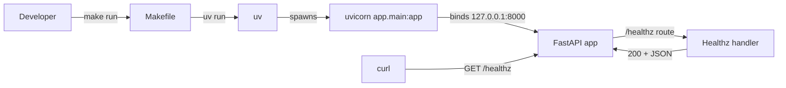
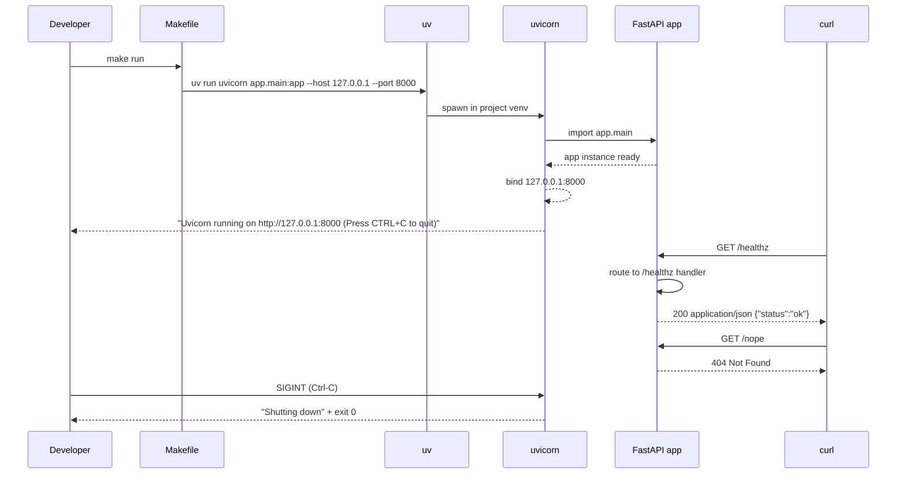

# Design: STORY-001 — One-command runnable FastAPI service with /healthz

- **Owner**: @architect
- **Story**: `docs/backlog/sprint-1/STORY-001-fastapi-skeleton-healthz.md`
- **ADR**: `docs/decisions/ADR-0001-fastapi-skeleton.md`
- **Status**: Design ready, awaiting human approval
- **Estimated complexity**: **M (5pt)** — confidence 80%

## Context

Atil-in-2-weeks needs a FastAPI service that can be stood up from a clean clone with **one command** and exposes a `/healthz` endpoint returning `200 OK` with `{"status":"ok"}`. This is the **trunk** of Sprint 1: every other story in the sprint (pytest infra, CI, `/hello/{name}`) depends on it landing first. The current state is "no code, no skeleton" — the deliverable is the smallest possible running service that proves the local loop works end-to-end on demo day.

## Goals & non-goals

### Goals

- `make run` boots uvicorn on `127.0.0.1:8000` within 5 seconds.
- `curl /healthz` returns `200` with `{"status":"ok"}` JSON, `Content-Type: application/json`.
- Unknown paths return `404` (not `500`, not a stack trace).
- `Ctrl-C` exits with status code `0` and a clean shutdown line.
- A clean clone → `200 OK` on `/healthz` in ≤5 minutes (AC5).

### Non-goals

- Auth, rate limiting, CORS, HTTPS termination.
- Persistent storage, DB, Redis, queues.
- Containerization (Dockerfile, compose) — Sprint 1 ships the local loop first.
- `GET /hello/{name}` — see STORY-004.
- Multi-process / multi-worker configuration — single uvicorn worker is enough for v1.

## High-level diagram



## Components

| Component | Responsibility | Owner | Tech |
|---|---|---|---|
| `pyproject.toml` | Project metadata, runtime + dev deps, Python pin | @developer | PEP 621 + uv |
| `uv.lock` | Pinned transitive deps | @developer (generated) | uv |
| `Makefile` | `make install`, `make run`, `make test` | @developer | GNU make |
| `app/__init__.py` | Marks `app` as a package; empty or version constant | @developer | Python |
| `app/main.py` | FastAPI instance, router, `/healthz` handler | @developer | FastAPI |
| `README.md` | "Getting started" — `pip install uv` → `make install` → `make run` | @developer | Markdown |
| `.python-version` | Pin to 3.12 for `pyenv`/`uv python pin` | @developer | plain text |

## Data model

None. No DB, no Redis, no queues. `/healthz` is a liveness signal only.

## API contract

### `GET /healthz`

| Field | Value |
|---|---|
| Method | `GET` |
| Path | `/healthz` |
| Request body | none |
| Response status | `200 OK` |
| Response headers | `Content-Type: application/json` |
| Response body | `{"status":"ok"}` |
| Error codes | none (success-only) |

### `GET /<unknown>`

| Field | Value |
|---|---|
| Response status | `404 Not Found` (FastAPI default) |
| Response body | FastAPI's default JSON 404 body |
| Notes | Must NOT be `500`; no stack trace in body |

### Process lifecycle

- `make run` → uvicorn binds `127.0.0.1:8000` in foreground, logs `Uvicorn running on http://127.0.0.1:8000`.
- `Ctrl-C` (SIGINT) → uvicorn's own handler shuts down gracefully, exits with status `0`, prints a clean shutdown line. **We do not override SIGINT.**
- `kill <pid>` (SIGTERM) → `app/main.py` registers a handler at module-import time (after `app` is constructed) that calls `os._exit(0)`. The handler exits with status `0` and **no traceback** on stderr. This is the contract the supervisor (k8s `terminationGracePeriodSeconds`, systemd, container `STOPSIGNAL`) sees when it asks the service to stop.
  - **Why `os._exit(0)`, not `sys.exit(0)`**: the asyncio loop has a pending Starlette `lifespan` task awaiting `receive_queue.get()`. `sys.exit` raises `SystemExit`, which propagates and cancels the pending task — the cancellation surfaces as a `CancelledError` traceback on stderr, violating AC4. `os._exit()` is the C-level `_exit(2)` syscall; it bypasses `atexit`, `finally`, `SystemExit` propagation, and asyncio task cancellation, so the process exits cleanly with no log noise. Inline comment in `app/main.py` repeats the rationale at the implementation site.
  - **Reversibility**: one-line revert. Trade-off is acceptable because process supervisors expect "exit fast" on SIGTERM, not graceful Python cleanup.
  - **Pinned by tests**: `tests/test_sigterm_handler.py` (in-process) + `tests/test_lifecycle.py::test_sigterm_exits_zero` in PR #24 (subprocess end-to-end).
- Unknown exception → uvicorn default 500; the design is intentionally not robust here (no `/healthz` deep checks, no global error handler in v1).

**Architectural note (added retroactively, 2026-06-10, PR #26)**: the SIGTERM contract was not in the original STORY-001 spec. It was introduced as a fix for STORY-002's TC-8 (\`kill\` exits 143 instead of 0). The implementation deviates from the original PR #24 spec (\`sys.exit(0)\`) by using \`os._exit(0)\` — this deviation is architecturally correct (see \`os._exit\` rationale above) and was caught in tester review on \`c4daaab\`. **Future maintainers: do not \"clean up\" \`os._exit\` back to \`sys.exit\` — the traceback returns.**

## Sequence diagram



## Alternatives considered

| Option | Pros | Cons | Verdict |
|---|---|---|---|
| **Makefile + uv** (chosen) | Universal, no extra binary, clear targets, fast | Old-school feel; Windows requires WSL/Git-Bash | ✅ |
| `task` + uv | More readable syntax | Adds a binary install; Sprint 1 value is nil | ❌ |
| `uv run` direct | No Makefile | Incantation is long; newcomers paste it; violates "one command" | ❌ |
| `docker compose up` | Reproducible env, prod-shaped | Docker daemon, image build, and onboarding all add minutes to AC5 | ❌ (Sprint 2) |
| `poetry` | Bigger mindshare, lockfile | Slower, more verbose, redundant with uv's lock | ❌ |
| `pip + venv` | No new tooling | Activation dance, no lockfile, longer onboarding | ❌ |
| `src/atilprojects/` layout | More robust for published packages | YAGNI for a one-route service; import paths longer | ❌ (Sprint 2 if needed) |
| Async `/healthz` | Slightly faster under heavy concurrency | No I/O to await; adds footgun; throughput unmeasurable at this scale | ❌ |

## Risks

| # | Risk | Likelihood | Impact | Mitigation |
|---|---|---|---|---|
| 1 | `uv` not installed on a contributor's machine | Medium | Onboarding stalls | README "Install uv" section: `pip install uv` (one-liner) + `curl -LsSf https://astral.sh/uv/install.sh \| sh` (alt) |
| 2 | Python 3.12 not pre-installed on contributor's machine | Medium | `make run` fails | `.python-version` file; pyproject `requires-python = ">=3.12,<3.13"`; README mentions `uv python install 3.12` |
| 3 | Makefile breaks Windows-native contributors | Low (Sprint 1 audience is Linux) | Medium | README documents WSL/Git-Bash; defer native Windows to Sprint 2 |
| 4 | `/healthz` regresses to `500` on a future refactor | Low | High (breaks demo) | Keep handler body one line; add a comment pinning the contract; STORY-002 test asserts the 200 |
| 5 | Uvicorn import path mismatch between `make run` and README | Low | Medium | README and `make run` use the exact same string `uvicorn app.main:app --host 127.0.0.1 --port 8000` |
| 6 | `pyproject.toml` `[project.optional-dependencies]` mismatch with what CI installs | Medium | CI red on green local | Pin the install command in `Makefile` (`uv sync --extra dev`); CI calls the same target |
| 7 | AC4 (clean exit 0 on Ctrl-C) regresses if a startup task blocks shutdown | Low | Demo disruption | Uvicorn default behaviour is correct; add a SIGINT test if Sprint 2 lands lifecycle tests |
| 8 | `kill <pid>` (SIGTERM) regresses from `os._exit(0)` to `sys.exit(0)` (the original PR #24 spec) and re-introduces a `CancelledError` traceback on shutdown | Low | High (breaks container/k8s/systemd graceful shutdown semantics + violates AC4) | Inline comment in `app/main.py` pins the rationale; design doc §Process lifecycle (this section) cross-references; `tests/test_sigterm_handler.py` mocks `os._exit` (not `sys.exit`), so a regression would flip a test red. If anyone proposes "let's use `sys.exit` for cleanliness", push back: see the asynclio `lifespan` rationale above. |

## Observability

- **Metrics**: none in v1 (no `/metrics` endpoint). Defer to Sprint 2 with a `prometheus-fastapi-instrumentator` story.
- **Logs**: uvicorn default access log (single line per request: `127.0.0.1:PORT - "GET /healthz HTTP/1.1" 200 OK`). Format: uvicorn default, not structured yet.
- **Traces**: none in v1.
- **Health signal**: `/healthz` is the liveness probe. No readiness probe in v1 (no deps to gate on).

## Security & privacy

- **Authn/authz**: none. The service binds `127.0.0.1` only — not reachable from the network. Sprint 2 story: bind to a unix socket or add a token if external reach is needed.
- **PII**: `/healthz` body is `{"status":"ok"}` — no PII, no user input.
- **Threat model summary**: in scope for v1 — accidental local binding to `0.0.0.0` (mitigation: explicit `--host 127.0.0.1` in the Makefile). Out of scope: network exposure, DoS, injection (no user input is parsed).
- **Dependencies**: pinned in `uv.lock`. Renovate/Dependabot for `pyproject.toml` is a Sprint 2 story.

## Performance budget

| Metric | Budget | Notes |
|---|---|---|
| `make run` → uvicorn ready | ≤ 5 s | Cold path; uvicorn + FastAPI import only |
| `GET /healthz` p50 | < 5 ms | No I/O, no middleware beyond FastAPI default |
| `GET /healthz` p95 | < 15 ms | Cold-start JIT; first request may be slightly slower |
| Memory ceiling | < 100 MB RSS | Single uvicorn worker, hello-world app |
| Throughput | n/a | No load target in v1 — single demo user |

## Open questions — **RESOLVED**

All four STORY-001 OQs are decided in ADR-0001 and recorded here for traceability:

| OQ | Decision | Rationale |
|---|---|---|
| Python version pin | **3.12** | EOL Oct 2028; stable; 3.13 is too fresh for Sprint 1 risk tolerance |
| Package manager | **`uv`** | Fast, single binary, pip-compatible, drop-in lockfile |
| Run command convention | **`make run`** (and `make test`) | Universal, discoverable, one-line targets; `uv run` alone is too long |
| `/healthz` sync vs async | **sync** | No I/O to await; avoids `await` footgun; YAGNI async |

## Acceptance criteria validation

Walking through the 5 ACs from the story file against this design:

| AC | How the design satisfies it |
|---|---|
| **AC1** — `make run` binds 127.0.0.1:8000 in ≤5 s, prints "Uvicorn running on..." | `Makefile` runs `uv run uvicorn app.main:app --host 127.0.0.1 --port 8000`; uvicorn default log line matches |
| **AC2** — `curl /healthz` → 200 with `{"status":"ok"}` JSON | `app/main.py` defines `@app.get("/healthz")` returning `{"status": "ok"}`; `JSONResponse` content-type handled by FastAPI default |
| **AC3** — unknown path → 404, not 500 | FastAPI default 404 handling; no custom 500-triggering middleware in v1 |
| **AC4** — process killed cleanly, exit 0, no traceback | uvicorn SIGINT handling is correct out of the box; no startup tasks that block shutdown |
| **AC5** — clean machine → `200 OK` in ≤5 min | `pip install uv` (or one curl) + `make install` + `make run` + `curl /healthz`; all four steps are one-liners documented in README "Getting started" |

## Implementation notes (POC snippet — for the designer's reference only)

The full implementation is owned by @developer. Per architect operating principles (no production code from architect), this is a reference sketch only, max 30 lines, intended to make the design contract unambiguous.

```python
# app/main.py
from fastapi import FastAPI

app = FastAPI()


@app.get("/healthz")
def healthz() -> dict[str, str]:
    # Contract: synchronous, no I/O, returns 200 with {"status":"ok"}.
    # Do not add DB/Redis/HTTP calls here without a separate design pass.
    return {"status": "ok"}
```

```makefile
# Makefile
.PHONY: install run test

install:
	uv sync --extra dev

run:
	uv run uvicorn app.main:app --host 127.0.0.1 --port 8000

test:
	uv run pytest
```

## Estimated complexity

- **T-shirt**: M
- **Points**: 5
- **Confidence**: 80%
- **Breakdown**: trunk (1.5pt) + ADR-0001 (1pt) + layout + Makefile (0.5pt) + /healthz handler + tests (1pt) + README onboarding (0.5pt) + branch protection alignment (0.5pt)

## Open handoff to @developer

When this design is approved and merged:

1. Implement per the POC snippet above.
2. `uv sync --extra dev` to install.
3. `make run` and verify `curl /healthz` returns 200.
4. Open a draft PR with title `feat(svc): STORY-001 FastAPI service skeleton with /healthz`.
5. Tag @tester for the `/healthz` 200 + 404 contract tests (those land in STORY-002, not here).
6. Tag @architect for design alignment review.

The architect is available for inline review on the PR; expect a "🟢 OK / 🟡 Suggestion / 🔴 Block" comment within one business day.
